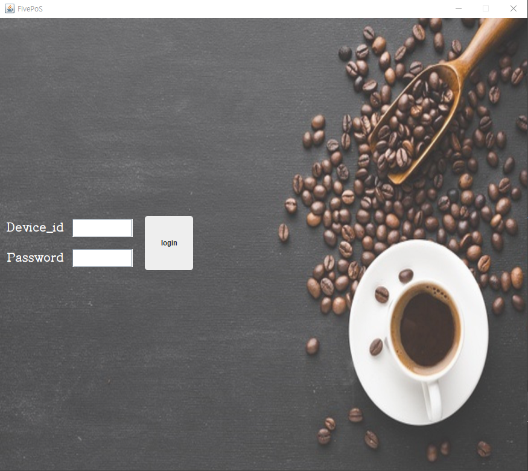
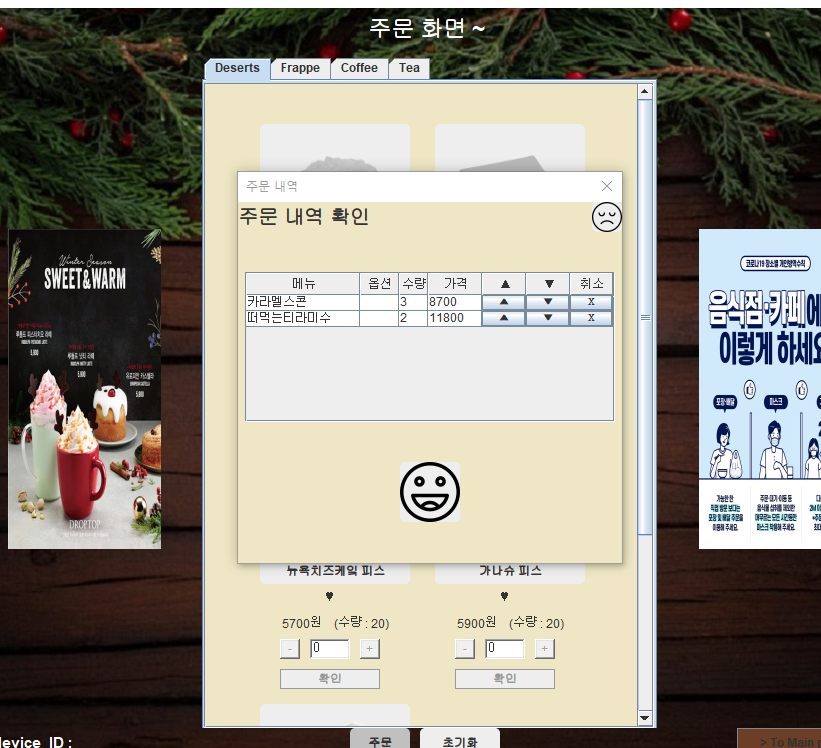
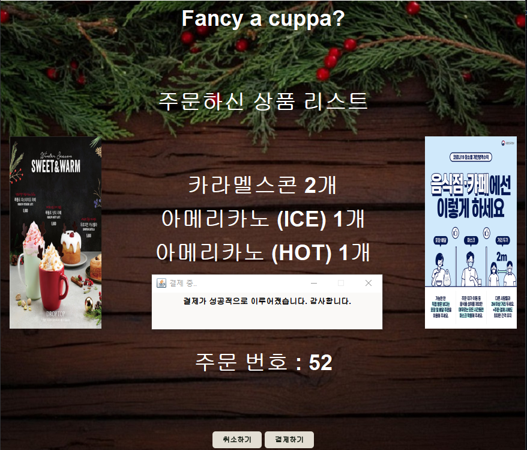
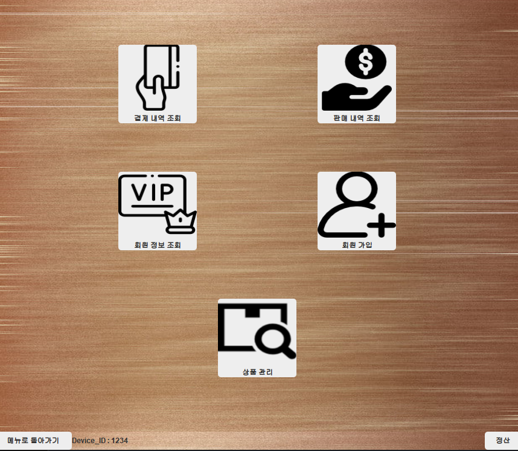
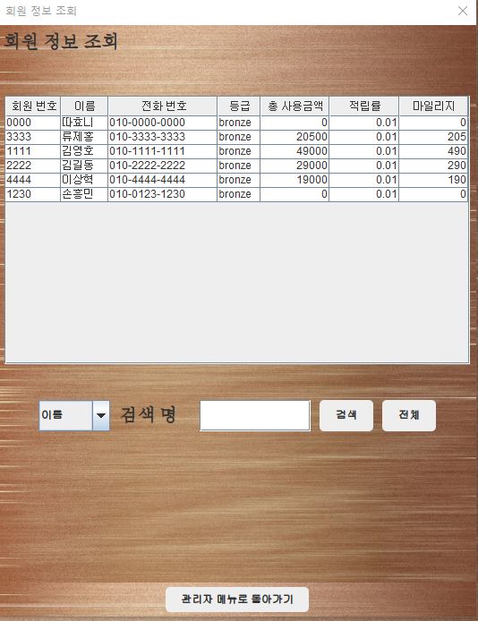

# 1차 프로젝트 'POS PROGRAM'

>[개요](#개요) / 
>[개발환경](#개발환경) / 
>[화면](#화면) 

 

### 개요
 >>#### 상품 판매, 회원 조회, 결제 내역 조회, 정산 등의 기능을 가진 카페 POS 프로그램
---
### 개발환경
>>* #### 개발언어 : JAVA
>>* #### Tool : eclipse
>>* #### DB : Oracle
---
### 화면
* #### 로그인 화면

* #### 판매
 

* #### 결제
 

* #### 관리자 모드
&nbsp;&nbsp;&nbsp;&nbsp;&nbsp;
