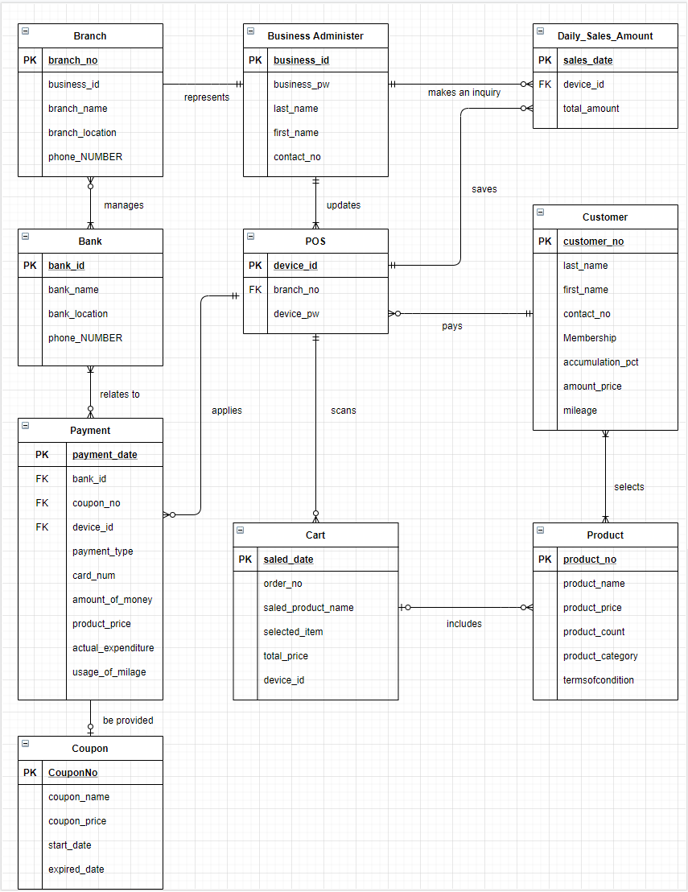
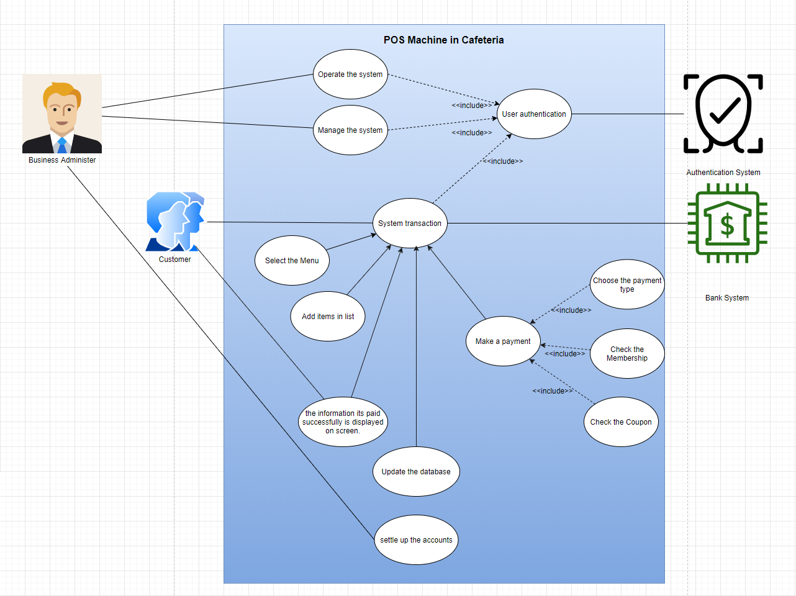

# 1차 프로젝트 'POS'

>[개요](#개요) /
>[개발환경](#개발환경) /
>[구상](#구상) /
>[코드 및 화면](#코드-및-화면) 

## 개요
 #### 상품 판매, 회원 조회, 결제 내역 조회, 정산 등의 기능을 가진 카페 POS 프로그램

## 개발환경
* ### 개발언어 : JAVA
* ### Tool : eclipse
* ### DB : Oracle

## 구상
* ### ERD

* ### UseCase

## 코드 및 화면
* ### 로그인 화면

* ### 판매

* ### 결제

* ### 관리자 모드

* ### 조회

